.. _ircchapter:

What is IRC?
=============

`Internet Relay Chat (IRC)
<https://en.wikipedia.org/wiki/Internet_Relay_Chat>`_ is an application
protocol to do text based communication. It was created in 1988 and still
being used as one of the primary communication medium for many people around
the world, including various Free and Open Source software projects.

.. figure:: img/348px-Tolsun_2.jpg

The above is the first ever IRC server (original image is from `Wikimedia Commons <https://en.wikipedia.org/wiki/File:Tolsun_2.jpg>`_).

We use IRC as our primary communication medium because it works with low bandwidth.
You don't need super fast internet connection to attend the summer training sessions. Also,
later when you will try to contact other communities, you will find most of them
are active on IRC.

What is a channel?
-------------------

Every IRC server has various virtual groups or rooms where people can
communicate with each other. These are known as channels. The channel names
start with *#* sign. For example, **#dgplug** is the channel name in Freenode
server for our training.

IRC clients
------------

There are various IRC clients, for our sessions you can use
**hexchat** client on your computer.

hexchat
--------

hexchat is a popular Internet Relay Chat (IRC) client. It has a choice of a tabbed
document interface or tree interface, support for multiple servers and is highly
configurable.

- `hexchat <https://hexchat.github.io/>`_

How to install?
---------------

For Fedora:

::

    # dnf install hexchat

For Ubuntu:

::

    # apt-get install hexchat

For windows please download hexchat from their `site
<https://hexchat.github.io/>`_.

Configurations Steps
--------------------

Default **hexchat** will open in network selection window where you have to select
*FreeNode* and then connect.

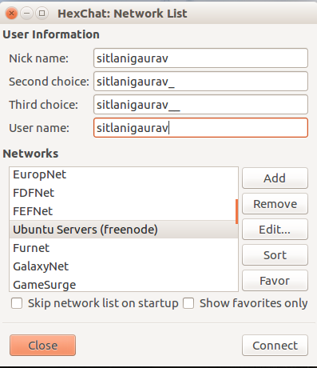

After connect you will see connection complete window where you have option to join channel (provide *dgplug*)

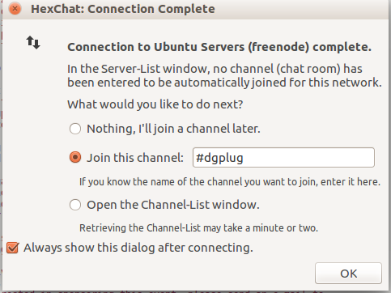

After pressing OK, you are now in main window and joined *#dgplug* channel. Now you have register your nickname to make sure someone else not using it.

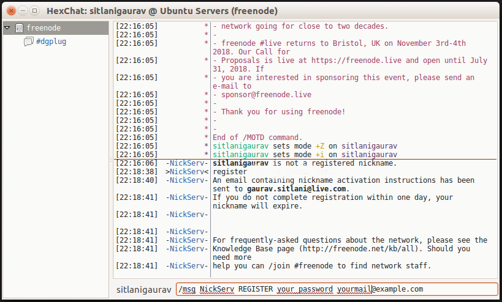

You will get a verification mail for your registration and same you have to execute in XChat window.

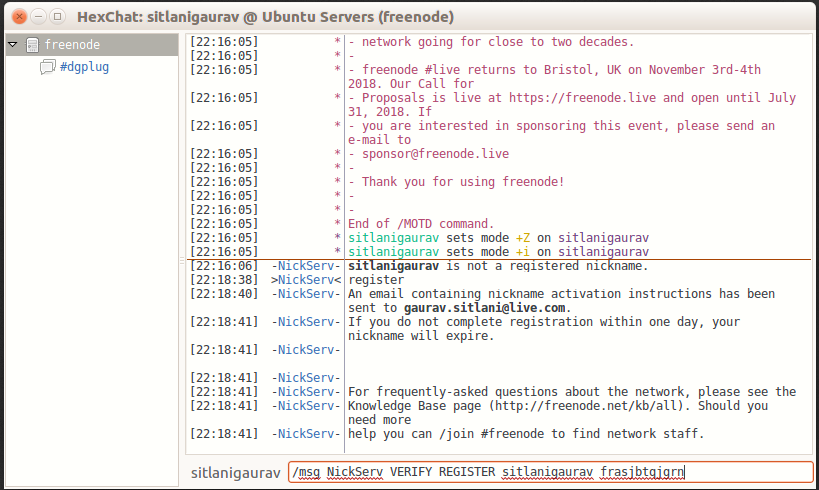

After verification one can authenticate to NickServ by issuing the following command

::

   /msg nickserv identify your_password

Authentication to NickServ in this fashion  can be tedious to do manually each time.
In HexChat, one can setup SASL authentication in the server options.
Open the network selection window with `Ctrl+S` and select the network to edit.
In the edit window, shown below, change the login method to SASL and fill in your password.

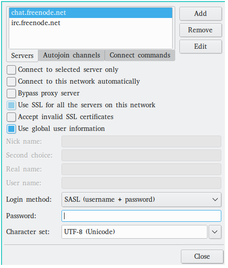

Below is a GIF which shows how to join the *#dgplug* channel on Freenode.

.. image:: img/hexchat.gif

.. note:: You can open the image in a new tab to view it in proper scale.

IRC on the Web
---------------

While a client (xchat, hexchat, etc), on any platform, is the best way to
experience IRC on a daily basis, you can in fact use your web browser to
connect to IRC!

While it might not be as comfortable as a native client, irc via a browser is
actually quite full featured.

It depends on you knowing commands though, so `this page on the IRC beginner
website <http://ircbeginner.com/ircinfo/ircc-commands.html>`_ will come in
real handy.

So let’s start at the very beginning.

Here’s what we’d need for our summer sessions.

1. We need a browser
2. We need an username that stays the same, throughout sessions
3. We need to login to the #dgplug channel on `Libera Chat <https://web.libera.chat>`_ with that username

Step 1. The Browser
-------------------

Congratulations!

You’ve already have one and are successfully connected, if you’re reading this
:)

Step 2. A username for IRC.
---------------------------

Let’s mosey over to the `Libera Chat website. <https://web.libera.chat>`_

|

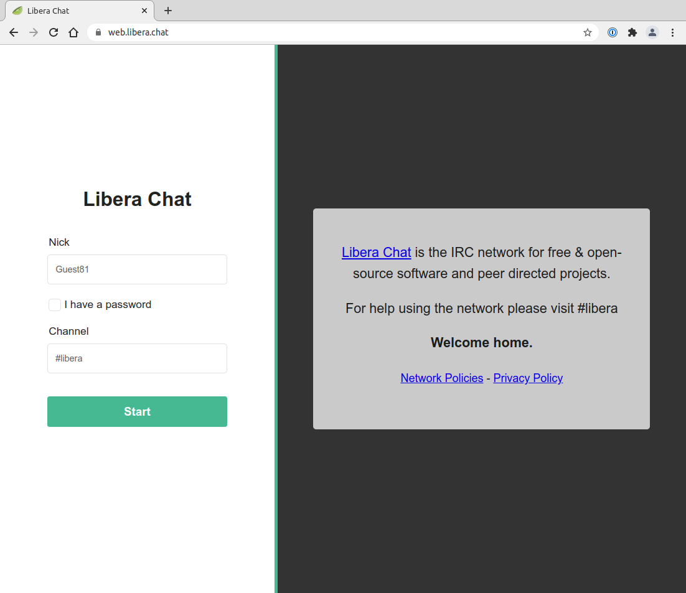

| 

| Login with the nickname you want, like I’ve done here.
| I’ve chosen ``mariojason`` for a nick.
| Clear the channel of the default channel that says #libera, so that it’s blank  
| Click Start. 

|

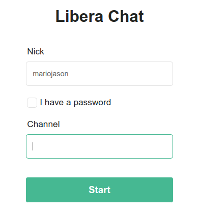

|

And you should enter the world of irc!

There’ll be a lot of stuff that’ll end with a screen like this.

|

.. figure:: img/webirc/lc/lc-webirc-03.png
   :width: 800px
   :align: center

|

| You’ll obviously have figured out that the little white box at the bottom, next to your nickname is where you type in your messages and commands. 
| You can type ``/quit`` to quit your connection for example. (Don’t do this yet)
| Also note the tabs on the left, specially the one that you are currently on, the one that says “Libera.Chat” (pointed to with red) at the top left of your window. 
| You’ll want to click this tab before typing in sensitive IRC commands (as you will do shortly).
| You’ll see more tabs, as you join channels later and you’ll use the tabs to switch between them.

| You in with your username? Good.
| Now let’s register it so that we can always have the same one.
| Type the command ``/msg NickServ REGISTER <password> <email>``, where password will be some complicated password of yours while email is where you put in your email address
| You can see me doing it below

.. figure:: img/webirc/lc/lc-webirc-04.png
   :width: 800px
   :align: center

|

If all works well, Nickserv will reply saying that activation instructions
have been sent to your email id, like so (click the NickServ tab on the left to read) …

|  

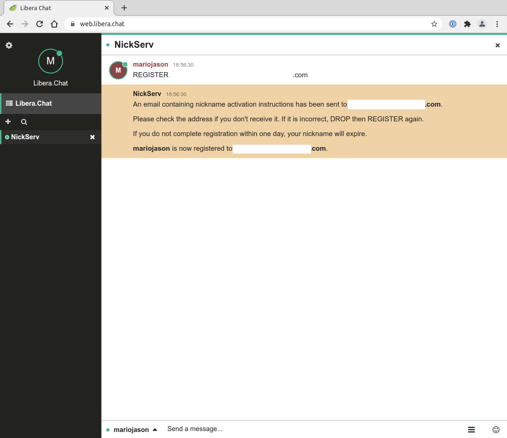

|

So hop over and check your mail. This is what you should expect to see.

|  

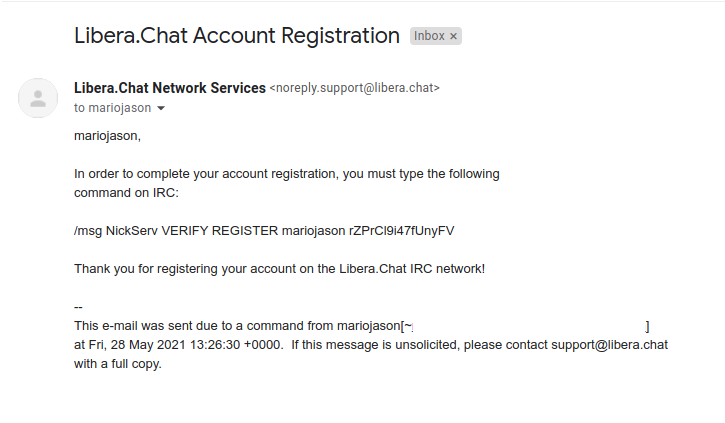

|

Let’s copy the ``/msg`` line and go back to the irc page and paste it in the
chat bar like so …

|  

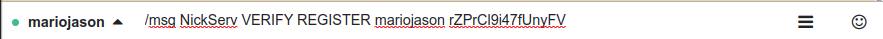

|

And voila! You should be verified!

|  

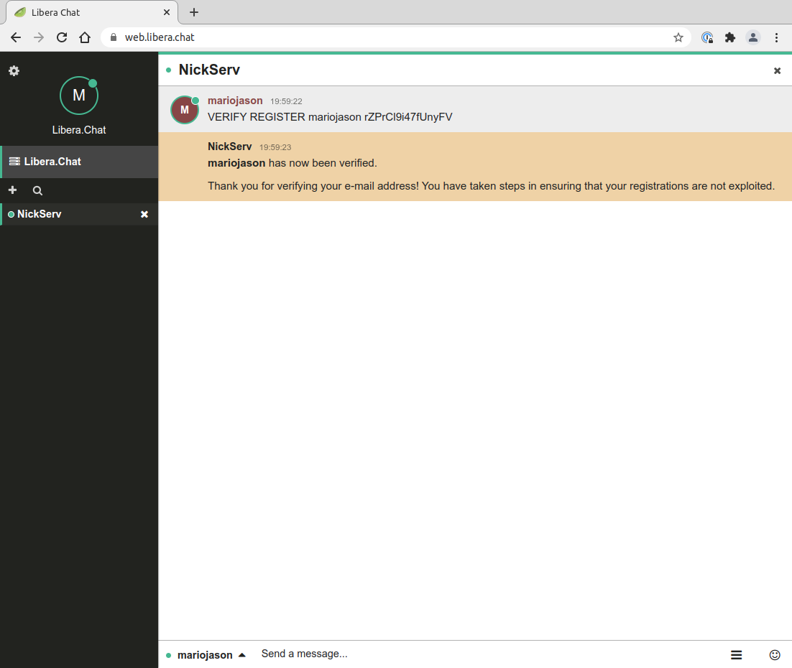

|

Now that we’re done registering our nickname, quit the connection by typing in
the ``/quit`` command and let’s move to …

Step 3. Connecting to the DGPLUG channel.
-----------------------------------------

Now we’re back to `where we started <https://web.libera.chat>`_.

Only this time, fill in all the details.

1. Put in your nickname
2. Make sure the *I have a password* box is checked
3. Put in your password in the box that appears for you to type in.
4. Change the channel name to #dgplug

And hit Start!

|

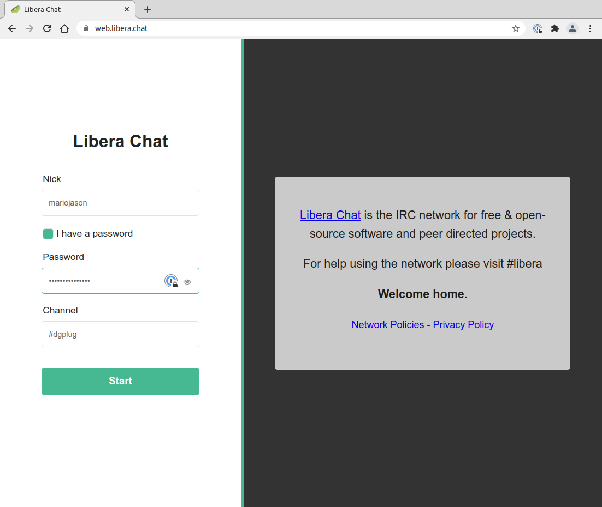

|

You should login and you should be switched to a new tab with the #dgplug channel.

|  

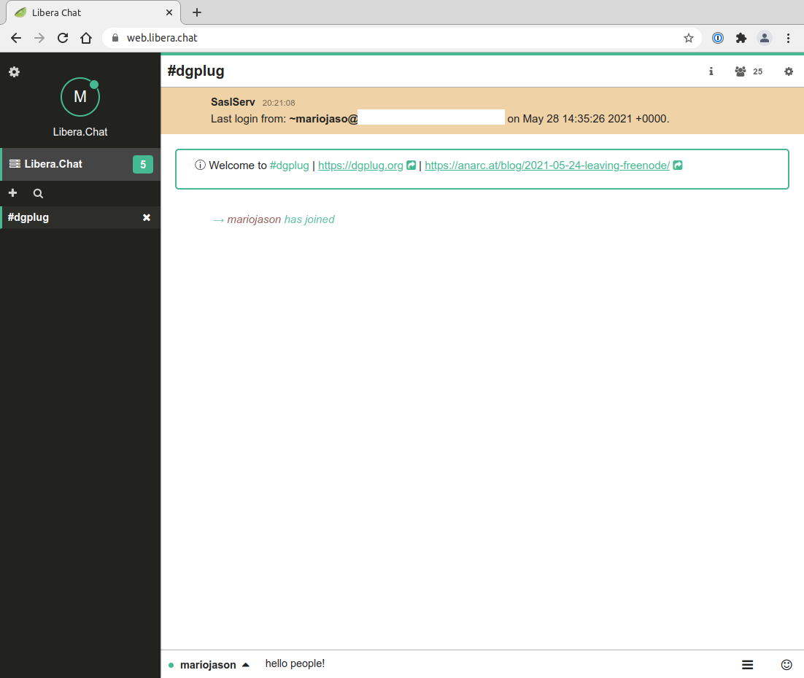

|

There! You’re in! Welcome! Enjoy your time in the channel :)

|  

Nick Ghosting
-------------

If for some reason, your nick lingers on after you are disconnected either due to a bad connection, or due to a `netsplit <https://en.wikipedia.org/wiki/Netsplit>`_, you will be unable to use your nick again since it already is on the server.
To remove the nick from the server, we need to **ghost** it.
To do this, make sure you are authenticated to NickServ and execute the following command::

   /msg nickserv ghost your_nick_name your_password
