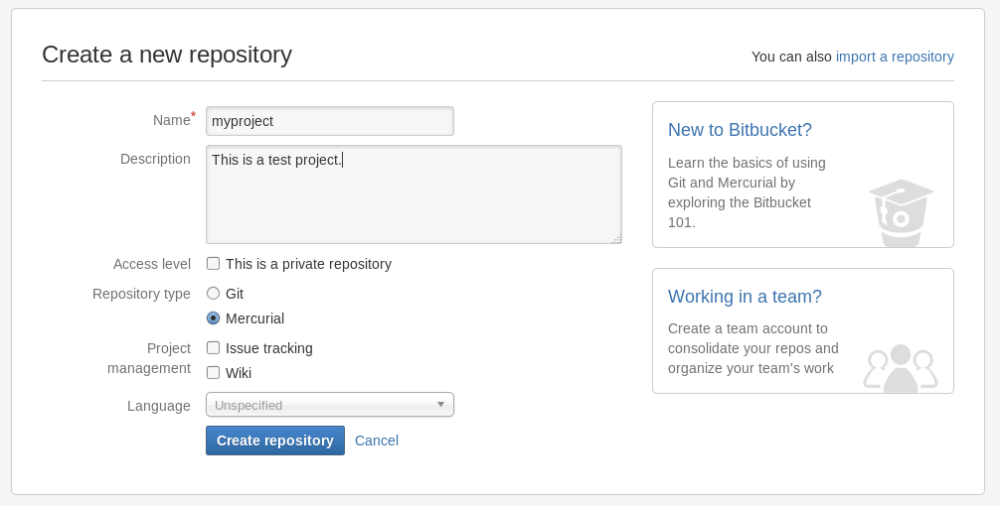
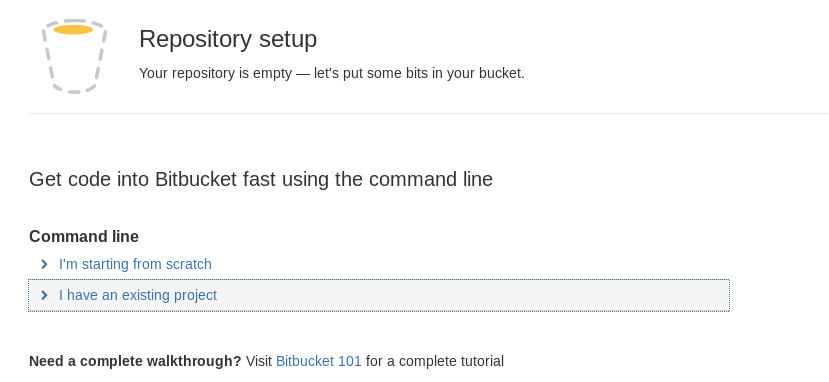
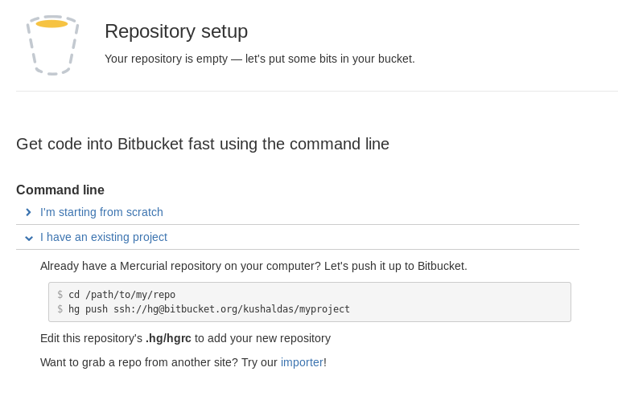

Mercurial
=========

Reverting some uncommitted change
----------------------------------

Say now we delete the file **hello.txt** from the directory by mistake. *hg status*
now shows that in output.
::

    $ hg status
    ! hello.txt

We can revert back all the changes in our repo by using the following command.
::

    $ hg revert --all
    reverting hello.txt

In case you made some changes to bye.txt and want to revert only that file, you
can do the following::

    $ hg revert bye.txt

Removing a file
----------------

Let us add another text file named **deleteme.txt**, write anything inside of that
file.::

    $ hg add deleteme.txt
    $ hg commit -m "Adds deleteme.txt file."

Now to remove it from the repository you can use remove command, remember to commit
after removing.::

    $ hg remove deleteme.txt
    $ hg status
    $ R deleteme.txt
    $ hg commit -m "Removes deleteme.txt file"

We can see the commit log now.::

    $ hg log
    changeset:   4:5b1b400f84c3
    tag:         tip
    user:        Kushal Das <kushaldas@gmail.com>
    date:        Wed Jul 16 17:34:40 2014 +0530
    summary:     Removes deleteme.txt file

    changeset:   3:5022651fd32b
    user:        Kushal Das <kushaldas@gmail.com>
    date:        Wed Jul 16 17:34:16 2014 +0530
    summary:     Adds deleteme.txt file.

    changeset:   2:0e558dd2a91d
    user:        Kushal Das <kushaldas@gmail.com>
    date:        Mon Jul 14 20:53:32 2014 +0530
    summary:     Adds bye.txt file and fixes hello.txt.

    changeset:   1:48bfb8a095cb
    user:        Kushal Das <kushaldas@gmail.com>
    date:        Mon Jul 14 20:29:59 2014 +0530
    summary:     Second commit.

    changeset:   0:a4754244eb89
    user:        Kushal Das <kushaldas@gmail.com>
    date:        Mon Jul 14 20:00:14 2014 +0530
    summary:     First change.

Difference between two revisions
---------------------------------

Using `hg diff` command we can actually see what all changed between two revisions.::

    $  hg diff -r 0:1
    diff -r a4754244eb89 -r 48bfb8a095cb hello.txt
    --- a/hello.txt Mon Jul 14 20:00:14 2014 +0530
    +++ b/hello.txt Mon Jul 14 20:29:59 2014 +0530
    @@ -1,1 +1,1 @@
    -Hello World.
    +Hello World!

Now think how to do the same for one particular file! :)

Bitbucket
----------

Visit `the site <https://bitbucket.org/>`_ and create an account there. After you login
goto to manage account and add your ssh key there.

.. image:: _static/bitbucket4.png

Now click on the Create button on the top menu to create a new repository. See the screenshot
below.

Now create the repository, which will bring you to the next screen. As we already have
a repository in our computer, we will use the second link there.

This will show the command required to push it to the repository so that everyone
can view it.

I am running the command as given there.::

    $ hg push ssh://hg@bitbucket.org/kushaldas/myproject
    pushing to ssh://hg@bitbucket.org/kushaldas/myproject
    searching for changes
    remote: adding changesets
    remote: adding manifests
    remote: adding file changes
    remote: added 5 changesets with 5 changes to 3 files

Now you can also create a file at **.hg/hgrc** so that you can just push/pull from
you repository easily.::

    [paths]
    default = ssh://hg@bitbucket.org/kushaldas/myproject
