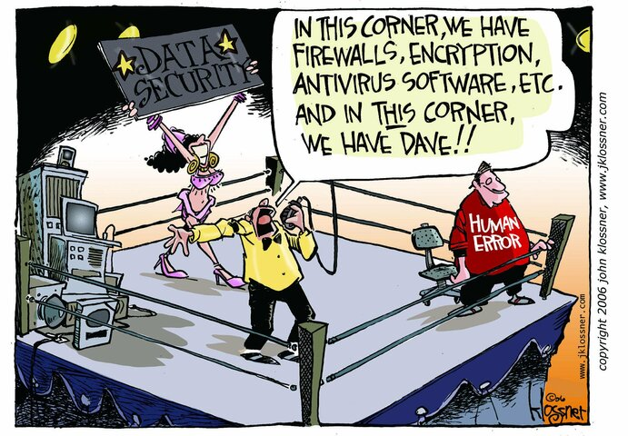
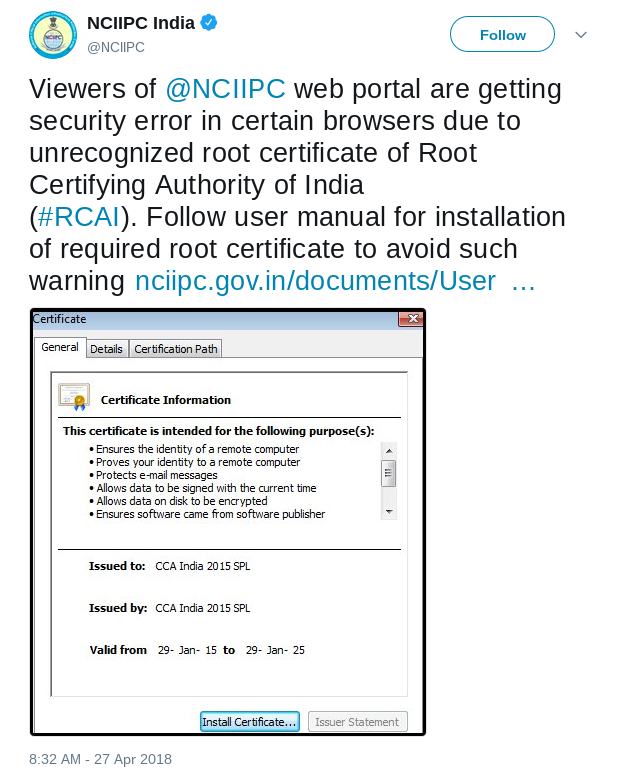

Good practices
===============

Here are a few suggestions on good practices while using computers daily life.
In this guide we mentioned a few major habits or tools., and then we also
provide links to documents to learn more about those habits or tools.

.. note:: You should read the previous chapter first, and then only start reading this
          chapter.

.. warning:: But, always remember, no technology can help user errors. So, think before you click any link or execute any random command.

Keep your machine updated
--------------------------

Always keep all the software updated. There are always new security updates
available, and we should install them as soon as possible. This is true not
only for normal computers, but, also for mobile phones and any other modern
smart home internet things.

If you don't update your computer regularly, or else an attacker can find out
the vulnerabilities in older version of the software or in the older version
of the operating system you are running and attack your computer. Remember
your threat model, think about what all things can go wrong if someone gets
access your computer because of older vulnerable software.

Use strong and unique passwords
-------------------------------

We should use unique passwords in different places. Otherwise, if someone can
get hold of one of your password, they can break into other sites/places with
the same password. We suggest using `diceware
<https://github.com/ulif/diceware>`_ to generate all of your passwords. To
learn more, please read `this blog post
<https://kushaldas.in/posts/using-diceware-to-generate-passwords.html>`_.

Use password managers
-----------------------

Password managers will help you to store all of those long passphrases in one
place. Learn from this guide about `password managers
<https://medium.com/@mshelton/password-managers-for-beginners-d1f49866f80f>`_.
`KeePassXC <https://medium.com/@mshelton/keypass-for-beginners-dc8adfcdad54>`_ is a good option on desktop.

Do not keep the computer unlocked
----------------------------------

If you are not in front of the computer, then always lock the screen. Do not
keep the computer unlocked, let it be inside your house, or in your hostel, or
in anywhere else. This is again an habit, and it takes time to make this
habit. Having the computer always password protected will make sure that any
person can not directly access your computer even if you are not front of the
computer for few minutes.

Cover up your webcam
---------------------

Over the last few years it became very well known that big agencies and
criminals can access people's webcams and record without anyone knowing.
Covering up your laptop webcam will protect you at one level against these
criminal activities. Here is `story
<http://thehill.com/policy/national-security/295933-fbi-director-cover-up-your-webcam>`_
which talks about how the FBI director also puts up a tape on his laptop's
webcam.

Take regular backups
---------------------

One should always backup their computer, and if possible more than one backup
copy. For example, you should at least backup your ssh keys, gpg keys, and all
other important configs in couple of **encrypted usb drives**.

.. note:: Learn how to encrypt your USB drives below

Enable 2 factor authentication
-------------------------------

Enable 2 factor authentication in all the websites or applications (if they
allow it). This will provide a second layer of security incase someone finds
your password.

If possible also stay away from SMS based 2 factor authentication. Instead,
use the mobile applications like **FreeOTP**, **Google Authenticator**,
**Authy**. These generates time based tokens which can be used as 2FA.

To learn more, read `this guide <https://medium.com/@mshelton/two-factor-authentication-for-beginners-b29b0eec07d7>`_.

To know more which all sites provides 2 factor authentication, visit
`https://twofactorauth.org <https://twofactorauth.org>`_.

Encrypt all USB drives
------------------------

While installing Linux in your system, you can encrypt the whole drive. This
will help in case your laptop is stolen or taken away by someone. This also means
try to keep your laptop in shutdown state most of the time, so that to boot the system,
one will have to provide the encryption password.

- For mac follow this `guide <https://support.apple.com/en-us/HT204837>`_.

.. note:: Use `Veracrypt <https://www.veracrypt.fr/en/Home.html>`_ to encrypt all removable drives.
          Follow `this guide <`https://freedom.press/training/encryption-toolkit-media-makers-veracrypt-guide/>`_ to learn the usage.

The same goes to the all USB devices you use. We have much bigger chance to
misplace or forget about small USB devices. `How to encrypt USB devices using
LUKS <https://kushaldas.in/posts/encrypting-drives-with-luks.html>`_ has all
the details you need to know to encrypt or decrypt any USB device.

Once again this is tied to your threat model, if you share or copy any kind of
sensitive documents (or example personal photos, or bank documents, or vital
other documents), having them in an encrypted device will help in case the
drive gets lost, or stolen.

Do not download and install random software from internet
----------------------------------------------------------

Do not download software from any random site and install them on your
computer. They may have malware or virus in them, which can attack not only
your computer, but also all the computers in the network. The same goes about
any software which says to execute some random shell script from internet.

On the other hand, one should always check different applications installed in
a computer, and remove the applications which we are not using regularly. This
will reduce the attack surface.

Do not plug random USB devices into your computer
--------------------------------------------------

If you ever find any random USB device in the parking lot, or on footpath, or
in college, do not plug that into your computer. This is one easiest way
people spread malware and systems get compromised. The same goes for [any USB
device handed over in a
conference](https://www.bbc.com/news/technology-43128073) or by booths at the
street side.

Use the following browser plugins for better privacy
-----------------------------------------------------

- `HTTPS Everywhere! <https://www.eff.org/https-everywhere/faq>`_
- `Privacy Badger <https://www.eff.org/privacybadger>`_
- `Disconnect.me <https://disconnect.me/>`_

Install the above mentioned plugins in your favorite browser. They are available
for both Firefox and Google Chrome browsers.

Do not trust private browsing mode to save your privacy
--------------------------------------------------------

Read this `document <https://medium.com/@mshelton/what-does-private-browsing-mode-do-adfe5a70a8b1>`_.

Use Tor for almost everything
------------------------------

Start using Tor browser for daily life. Read the previous chapter on Tor
Project to know more. You may want to split your browsing between different
browsers. For example, you can use one of the browsers (Firefox or Google
Chrome) for your email and github accounts, one for all banking purpose. And
then use Tor for the rest.

If you start using Tor Browser for social media sites like Facebook or
Twitter, or reading different news websites, it will be difficult for anyone
to track your browsing history. Tor Project `published a blog
<https://blog.torproject.org/dont-let-facebook-or-any-tracker-follow-you-web>`_
post explaining this in details.

Your local ISP will know that you are using Tor, but, they will not have any
clue about what all sites you are visiting. Visit `the EFF site
<https://www.eff.org/pages/tor-and-https>`_ to understand who all can see
which part while you are using Tor.

One strategy can be using more than one browser, say using Google Chrome for
your gmail or youtube accounts, and then use Firefox for banking and other
important tasks. Then you can move all of your other browsing in the Tor
Browser.

About communication tools on phone
-----------------------------------

Do not use `Telegram` or even have it installed on your phone. You can use
`Signal <https://signal.org>`_ for any kind end-to-end encrypted communication
from your phone (it is available for your Linux desktop too). Martin again
wrote another `amazing guide
<https://medium.com/@mshelton/signal-for-beginners-c6b44f76a1f0>`_ for Signal.

Also always rememeber that end-to-end encryption does not mean no one can ever
read your messages, the other person can loose the phone or someone may steal
your phone. Some times some friend may just want to check those amazing photos
on your phone, and then click on the Signal app and read all the messages
there.

.. figure:: img/security.png

(Original work: `https://www.xkcd.com/538/ <https://www.xkcd.com/538/>`_ )

Do not click on random links in emails or from anywhere else
-------------------------------------------------------------

Many people are attacked by simple phishing attacks where someone sends a
random link (which looks like a normal known website URL). They many times
also provides downloads and ask the victims to download and open those
attachments in the victim's computer.

To avoid from any such phishing attacks, make sure that don't click on any URL
in emails or random websites. Also, always think about any email attachments,
before downloading or opening those files. The same goes to any PDFs you
receive over email.

https://www.youtube.com/watch?v=iJcQNgVtH8Y

Do not install random certificate on the browser
-------------------------------------------------

Do not trust any random certificate from internet. Only trust the certificates
come as bundled with the browser. For example, in `this tweet
<https://twitter.com/NCIIPC/status/989890103400054784>`_ one government agency
asked people to install a certificate from Root Certifying Authority of India.
But, the same is `already blacklisted
<https://security.googleblog.com/2014/07/maintaining-digital-certificate-security.html>`_
for issuing fake certificates.

SURVEILLANCE SELF-DEFENSE
--------------------------

Now read `SURVEILLANCE SELF-DEFENSE <https://ssd.eff.org/>`_, you will get a
chance to know things in much more detailed level.

Talks from around the world
============================

Below are a few talks on OPSEC from different conferences around the world.

- `DEF CON 22 Blinding The Surveillance State <https://www.youtube.com/watch?v=xCH_q-xn760&t=3s>`_
- `#HITB2012KUL D1T3 - The Grugq - OPSEC: Because Jail is for wuftpd <https://www.youtube.com/watch?v=9XaYdCdwiWU>`_
- `We’re Not Equally Vulnerable to Surveillance | Chris Soghoian at MozFest <https://www.youtube.com/watch?v=zTZbrkV3bs8>`_
- `DEF CON 22 - Robert Rowley - Detecting and Defending Against a Surveillance State <https://www.youtube.com/watch?v=d5jqV06Yijw>`_
- `OPSEC for security researchers <https://www.youtube.com/watch?v=MXDCsSZ7g_0&t=1515s>`_
