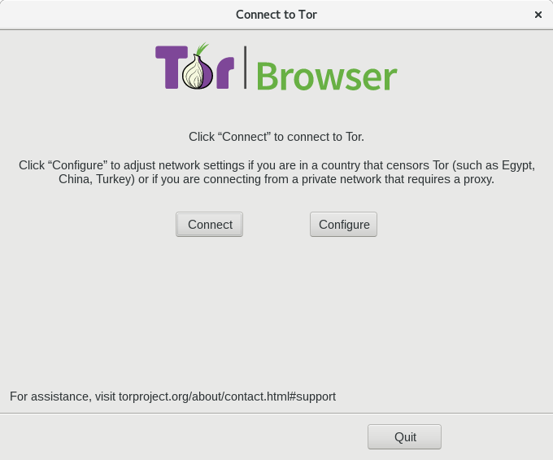

.. _torchapter:

Tor Project
============

    What is Tor?
        Tor is free software and an open network that helps you defend against traffic
        analysis, a form of network surveillance that threatens personal freedom and
        privacy, confidential business activities and relationships, and state
        security.

The `Tor Project <https://www.torproject.org>`_ is the most suggested project
when it comes to protect privacy and anonymity. We suggest dgplug participants
to download the Tor Browser, and start using it for regular Internet access
from the beginning.

Why should you use Tor?
------------------------

Watch this `youtube video <https://www.youtube.com/watch?v=JWII85UlzKw>`_.

.. warning:: Always download Tor Browser from the Tor Project website, do not
             download or use it from any other random website.

How to install and run Tor Browser?
------------------------------------

Visit the `download page
<https://www.torproject.org/download/download-easy.html.en>`_ and then
download the *tar* file, and also the signature file. Please verify the
download before you start using it, the steps for the same are given in `this
page <https://www.torproject.org/docs/verifying-signatures.html.en>`_.

.. figure:: img/tor_browser_part1.gif

.. note:: You can open the image in a new tab to view it in proper scale.

The above graphics shows the steps, you can execute the desktop file to
start the browser.

::

    ./start-tor-browser.desktop

You will see the above window when Tor Broswer starts, just click on the
**Connect** button, and then it will connect to the Tor network. For the first
time the connection will take some time, afterwards it will be much faster.

How does Tor actually work?
---------------------------

Read this `overview page <https://www.torproject.org/about/overview.html.en>`_
to learn how does Tor actually works.

