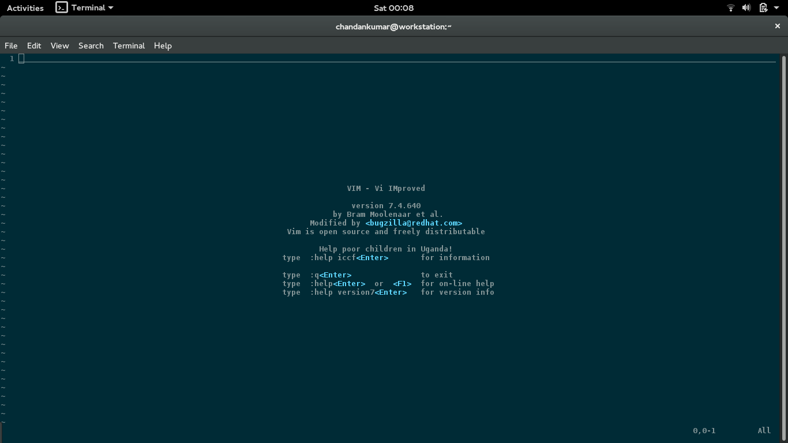
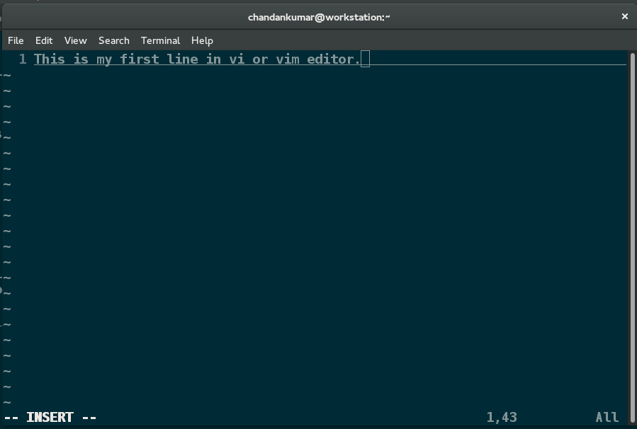

vi or vim editor
================

We use editors to create or edit text files. For many of the dgplug's member it is the de-facto editor
for programming.

How to install?
---------------

For Fedora:
::
  $ sudo dnf install vim

For Ubuntu
::
  $ sudo apt-get install vim

Launch vim
----------
To open vim editor, type
::
    $ vim

To open a file in vim editor, type
::
    $ vim hello.txt

It will open a file 'hello.txt' in vim editor. It is in normal mode.
If it is a new file, it will be empty.
If it is an old file, then it will show some contents.

To write something in the file, Press *i* from the keyboard then type something in the file.

Now the vi editor is in INSERT mode.

To save the file, first press *Esc*, then type *:w* followed by *Enter* to save changes in the file.
By pressing *:q*, we can close the file. Now, you are back to the terminal prompt.
We can use *:x* to save the contents of the file and close the file.

Let us again open the same file in vim editor, press *i*, then type random text.
Now if you donot want to save, but want to go back to the last saved revision.
just type *:e!* after pressing escape.
If you donot want to save anything and also exit then type ':q!'.

Movement with in a file
-----------------------

Let us reopen the file and do some basic movements with in the file.

Press *h* to move 1 char left

Press *j* to move 1 char down

Press *k* to move 1 char up

Press *l* to move 1 char right

To move word by word, press *w*

To come back word by word, press *b*

To go back to the beginning of the line, press *0*

To go back end of the line, press *$*

Cut, Copy, Paste
----------------

*e* - To edit some text at the current cursor position

*a* - To append some text at the current cursor position

*r* - To replace to with some new character

*x* - To delete a character

To change a word - *cw*

To change from the cursor to the end of the line - *c$*

To change from the cursor to the beginning of the line - *c0*

To change a whole line : *cc*

*d* - Too delete a character

*dw* - Too delete a word

*d$* - Too delete up to end of the line

*dd* - Too cut/delete a whole line

*d0* - To delete at the beginning of the line

*x* - To cut a line

*xw* - To cut a word

*xx* - To cut a whole line

*y* - To copy

*yy* - To copy a whole line

*p* - To paste

To copy 2 lines - *2yy*

To delete 2 words - *2dw*

To see line number - *:set nu*

To go to particular line - *: <line number>*

To turn off line number - *:set nu!*

Playing with multiple files
---------------------------

To open multiple files
::
    $ vi file1 file2 .... filen

To move around the files

*ctrl + F* --> Forward one screen

*ctrl + B* --> Scroll backward

*ctrl  + D* --> Forward half secreen

*ctrl + U* --> Backward halfscreen

Find and Replace
----------------

to search a string: */<searchstring>*

Press *n* to get to the next occurances

To move search in opposite direction - *N*

To search specific text backward - *?searchtext*

*:s/oldstring/newstring* - will replace the first occurence of the oldstring to the newstring

To replace all occurrences of the oldstring to new string in that line : *:s/oldstring/newstring/g*

To replace in all lines *:1,$s/oldstring/newstring/g*

File Splitting in vim
---------------------

To split the file, type

*:split* - for horizontal split

*:vsplit* - for vertical split

Word Completion
---------------

In insert mode press Ctrl + p or Ctrl + n to do word completion

Where to go Next
----------------
To read more about Vim editor, open the terminal and type
::
    $ vimtutor
