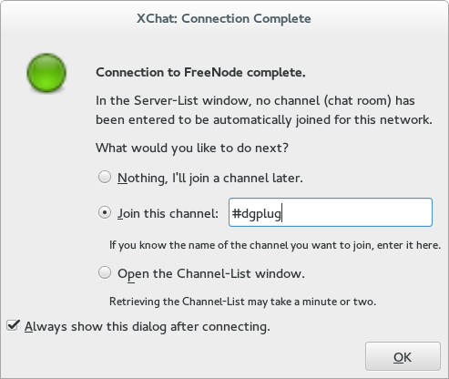
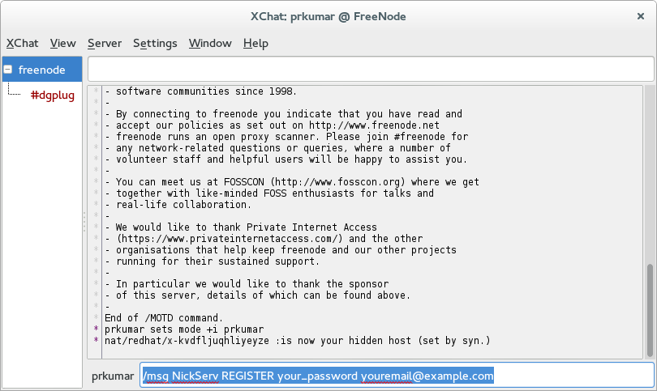
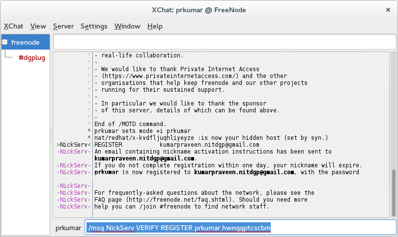

IRC clients
===========

There are various IRC clients, for our sessions you can use either xchat or hexchat client
on your computer.

XChat or hexchat
================

XChat/hexchat is a popular Internet Relay Chat (IRC) client. It has a choice of a tabbed
document interface or tree interface, support for multiple servers and is highly
configurable.

- `hexchat <https://hexchat.github.io/>`_
- `XChat <http://xchat.org/docs/start/>`_

How to install?
---------------

For Fedora:

::

    # dnf install xchat

For Ubuntu:

::

    # apt-get install xchat

For windows please download hexchat from their `site <https://hexchat.github.io/>`_.

Configurations Steps
--------------------

Default xchat will open in network selection window where you have to select *FreeNode* and then connect.

.. figure:: img/xchat1.png
   :width: 600px
   :align: center

After connect you will see connection complete window where you have option to join channel (provide *dgplug*)

After pressing OK, you are now in main window and joined *dgplug* channel. Now you have register your nickname to make sure someone else not using it.

You will get a verification mail for your registration and same you have to execute in XChat window.

Enjoy Xchating ...
